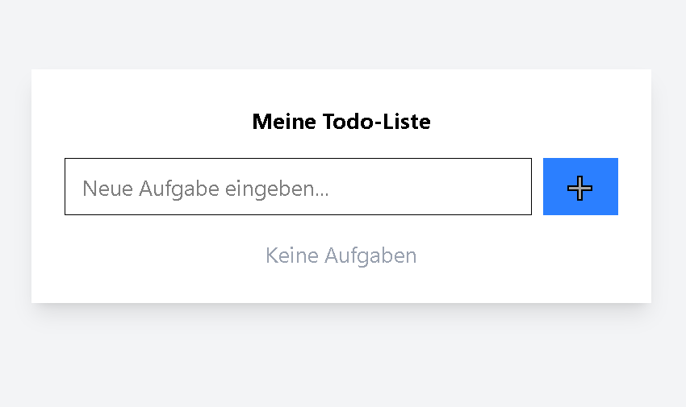
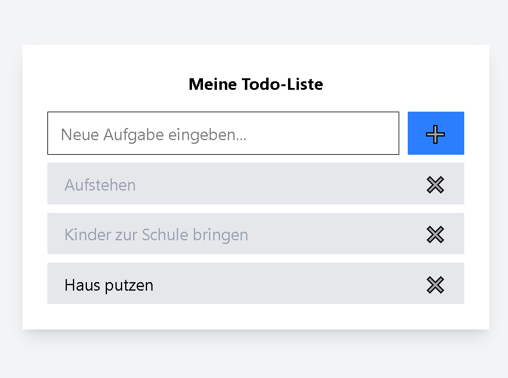

# ✅ TodoApp – Vue 3 Projekt  


Eine minimalistische **Todo-Liste**, umgesetzt mit **Vue 3**, **Tailwind CSS** und **Vite**.  
Dieses Projekt wurde zu Lernzwecken erstellt und zeigt die Grundlagen von **Reaktivität**, **Zustandsverwaltung** und **UI-Design**.  

---

## 🚀 Features  
- ➕ Aufgaben hinzufügen  
- ✅ Aufgaben als erledigt markieren  
- ❌ Aufgaben löschen  
- 🎨 Responsive UI mit Tailwind  

---

## 🛠️ Technologien  
Vue 3 · Tailwind CSS · JavaScript (ES6) · Vite  

---

## 📦 Installation  

### Voraussetzungen  
- Node.js (>= 18)  
- npm 

### Schritte zur Ausführung  
1. Repository klonen  
   ```bash
   git clone https://github.com/yvanzambou/vue-todo-app.git
   cd todo-app-vue

2. Dependencies installieren  
   ```bash
   npm install

3. App starten  
   ```bash
   npm run dev

---

## 🖼️ Screenshots




---

## 📄 Hinweis  
Dieses Projekt ist ein **Lernprojekt** und dient nur zu Demonstrationszwecken.  

---

## 👤 Autor  
**Yvan Zambou**  

[](https://linkedin.com/in/yvan-zambou-29aba9261)  
[](https://github.com/yvanzambou)  

---
